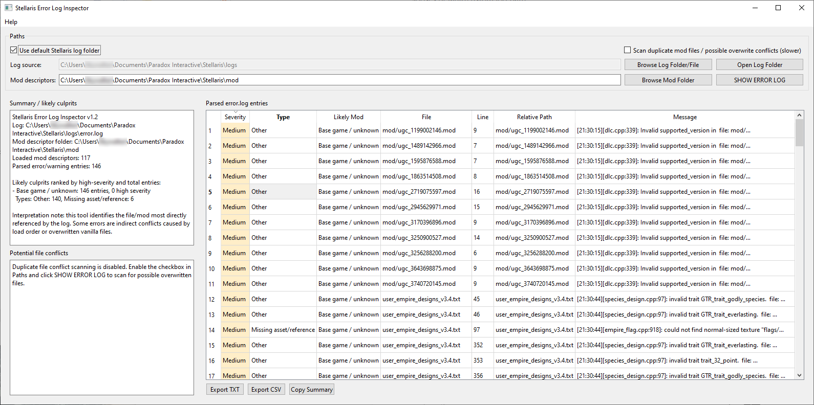

Stellaris Error Log Inspector
=============================

A tool for reading Stellaris error.log and estimating which mod files/mods are most likely related to reported errors.

Windows 10/11 users can download the EXE here: 
https://github.com/non-npc/Stellaris-Error-Log-Inspector/releases/tag/v1.0

Install
-------
pip install -r requirements.txt

Run
---
python stellaris_error_log_inspector.py

Workflow:
1. Launch the app.
2. Use the default Stellaris log folder, or browse to a custom log folder/file.
3. Confirm or change the Stellaris mod descriptor folder.
4. Click SHOW ERROR LOG.

Optional:
- Enable duplicate mod file scanning only if you want possible overwrite/conflict hints. This can be slower on large mod libraries.

Default paths
-------------
Log folder:
Documents/Paradox Interactive/Stellaris/logs

Mod descriptor folder:
Documents/Paradox Interactive/Stellaris/mod

Notes
-----
The tool maps error.log file paths to mods by reading .mod descriptors and descriptor paths. 
It cannot prove every indirect conflict, but it can usually identify the file and likely mod most directly referenced by the log.
